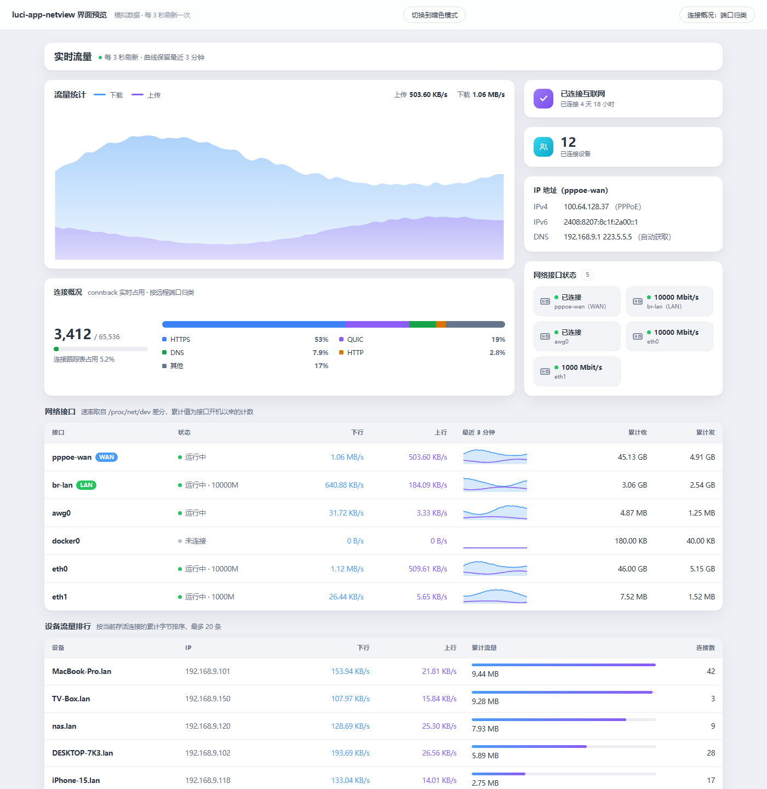
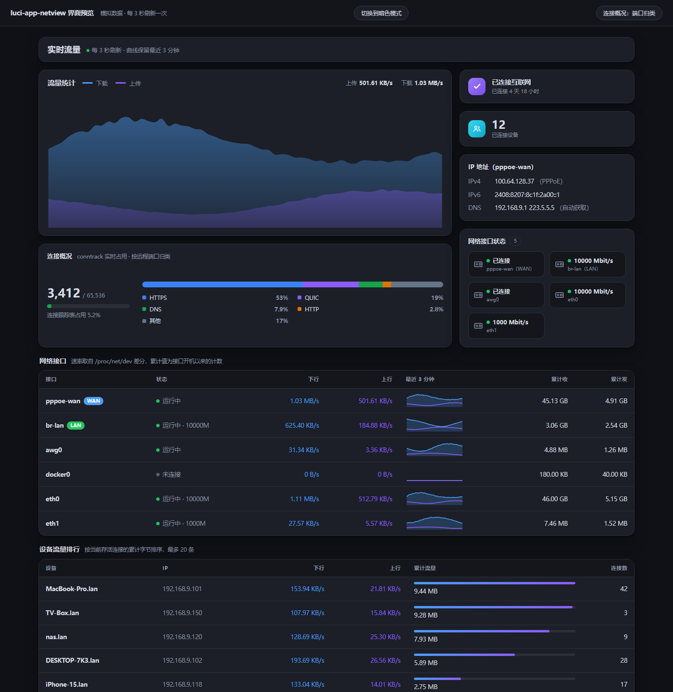

# luci-app-netview

[](LICENSE)
[](https://github.com/zhouzhouzk/luci-app-netview/releases/latest)

ImmortalWrt / OpenWrt 的实时网络流量查看器（LuCI 插件）。

针对 **ImmortalWrt 24.10.6 (x86/64)** 编写，兼容 21.02 - 24.10 全系（LuCI2 / JS 版）。

界面参考 [iStoreOS](https://github.com/istoreos) 的快速设置页：左侧一块大卡片放汇总流量曲线，
右侧一列窄卡片放连接状态与接口信息，下方两张明细表。

装好后它排在「状态」组的第一个，**也是登录后直接落在的页面** —— 详见[默认首页](#默认首页)。

## 界面



<details>
<summary>暗色模式</summary>



</details>

> 截图取自 `preview/overview-preview.html`，用模拟数据渲染 —— 所以设备名、IP、速率都是编的。
> 在路由器上打开 `/cgi-bin/luci/admin/status/netview` 看到的是同样版式、真实数据。

## 功能

| 区块        | 内容                                                    | 数据来源                            |
| --------- | ----------------------------------------------------- | ------------------------------- |
| 流量统计（主图）  | 汇总 **WAN 出口**的实时上下行，平滑渐变面积曲线，保留最近 3 分钟                | `/proc/net/dev`                 |
| 连接状态      | 互联网是否连通、已连接时长                                         | `ifstatus wan`                  |
| 已连接设备     | 在线设备数量                                                | `/proc/net/arp`                 |
| IP 地址     | WAN 的 IPv4 / IPv6 / DNS，标注协议（DHCP / PPPoE / 静态）与 DNS 是否自动获取 | `ip addr`、`resolv.conf.auto`     |
| 网络接口状态    | 各网卡的协商速率（Mbit/s）与它承载的逻辑接口；软件接口没有速率，改报链路状态            | `/sys/class/net/*/speed`        |
| 网络接口      | 每个接口的实时速率、最近 3 分钟曲线、累计收发                              | `/proc/net/dev`                 |
| 设备流量排行    | 局域网每台设备的实时速率、累计流量、连接数、MAC 地址与可编辑别名                    | `/proc/net/nf_conntrack`        |

- **零额外安装**：不依赖 `nlbwmon`、`vnstat`、`collectd`，只用内核已有的 `/proc` 与 `/sys`
- **仅实时**：数据全部驻留内存，不落盘、不写数据库，重启即清空
- **WAN / LAN 自动识别**：通过 `ifstatus` 解析逻辑接口，自动打标签并优先排序
- **主图只统计 WAN**：不会把内网互传算成"上网流量"；识别不到 WAN 时退化为全部接口，保证图不空
- **设备别名**：设备名只读，别名单独一列可点铅笔编辑，按 MAC 归属设备（换 IP 不掉），存 UCI 重启不丢
- **登录即首页**：登录后直接落在本页，不用再点一次菜单（见[默认首页](#默认首页)）

## 默认首页

**访问 `http://<路由器IP>/`，或者登录提交之后，落地的就是实时流量页。**

靠的是 `menu.d` 里的一个数字：

```json
"admin/status/netview": {
	"title": "网络流量",
	"order": 0,
	...
}
```

它比「状态 > 概况」的 `order: 1` 小，所以在「状态」组里排第一，同时也是计算默认落地页时胜出的那一项。

### 为什么一个 order 就能改掉首页

LuCI 里是这几段串起来的（原文摘录在 `tools/fixtures/upstream/`，可逐行核对）：

| # | 位置                                | 做的事                                                  |
| - | --------------------------------- | ---------------------------------------------------- |
| 1 | `dispatcher.uc` `build_pagetree()`  | 把每个 `menu.d` 的 `"a/b/c"` 展开成节点树                        |
| 2 | `dispatcher.uc` `resolve_firstchild()` | 逐层挑 order 最小的可访问项 —— 这就是默认落地项                        |
| 3 | `dispatcher.uc` 登录分支             | `http.redirect(build_url(...resolved.ctx.request_path))`，跳回第 2 步算出的路径 |
| 4 | `ui.js` `ui.menu.getChildren()`     | 侧边栏的显示顺序（**另算一套**，不是同一个排序）                            |

所以 `order` 看着只是"菜单里排第几"，实际同时是"登录后落在哪"。

### 两个容易踩的点

- **不能靠 order 打平取胜。** 第 2 步和第 4 步对"order 相同"的处理**不一样**：后端保留先遍历到的
  （取决于 `menu.d` 的加载顺序），前端按 `L.naturalCompare(name)` 排。打平就可能出现"侧边栏在左边、
  登录却落在右边"的错位。要赢就得**严格更小**。
- **`order: 0` 是安全的。** 两处用的都是 `??`（nullish）—— `min(node.order ?? 9999, 9999)` 和
  `order ?? 1000` —— 而不是 `||`；否则 0 会被当成 falsy 顶到菜单末尾。`tools/menu.test.js` 把这条也钉住了。

### 想改回「概况」当首页

把 `root/usr/share/luci/menu.d/luci-app-netview.json` 里的 `"order": 0` 改回 `30`（回到「状态」组末尾、
不再抢首页），然后清一下菜单缓存：

```sh
rm -f /tmp/luci-indexcache*        # 通配符不能少，实际文件名是 luci-indexcache.<hash>.json
/etc/init.d/rpcd reload
```

（菜单缓存的 key 里含各 `menu.d` 的 inode/mtime/size，文件一改就会自动重建，手工清只是省得等。）

### 装了 luci-mod-dashboard 的话

[luci-mod-dashboard](https://github.com/openwrt/luci/tree/master/modules/luci-mod-dashboard) 是独立的
顶层首页插件，注册在 `admin/dashboard`、`order: 1`，比「状态」组的 `10` 更靠前 —— 它会**优先拿到首页**。
这时本插件仍排在「状态」组第一，但登录落地页由 dashboard 决定。我们不去抢这个。

真想让 netview 赢过它，得换层级：把 `"admin/status/netview"` 改成 `"admin/netview"` 并把 order 设成 `0`。
代价是侧边栏会多出一个独立顶层项。`tools/menu.test.js` 里有一条断言记录了这个行为。

### 菜单顺序的变化

「网络流量」成为「状态」组第一项，「概况」退到第二位，其余不变：

```
状态
  网络流量   ← 本插件，order 0
  概况       ← 原第一项，order 1
  路由
  防火墙
  系统日志
  进程
  实时信息
```

## 依赖

以下依赖**全部包含在官方镜像里**，装这个包不会额外拉任何软件：

| 包           | 用途                                                             | 24.10.6 官方镜像       |
| ----------- | -------------------------------------------------------------- | ------------------ |
| `luci-base` | JS 视图运行时。`rpc` / `poll` / `view` 自 LuCI 23.x 起已内联进 `luci.js`，不再有独立文件；同时它提供本插件挂载的 `admin/status` 菜单父节点 | ✅ 已预装             |
| `rpcd`      | `/usr/libexec/rpcd/` 插件的执行环境，负责把脚本暴露成 ubus 对象                     | ✅ 已预装             |
| `jshn`      | `/usr/share/libubox/jshn.sh`，输入解析和输出生成都靠它                        | ✅ 已预装             |
| `netifd`    | 提供 `ifstatus`，用来把逻辑接口 wan/lan 解析成真实内核设备名                        | ✅ 已预装             |

另外还有一个**内核侧的功能前提**（不是包依赖，所以没有写进 `Depends`）：

| 内核模块                 | 用途                                      | 24.10.6 官方镜像 |
| -------------------- | --------------------------------------- | ---------- |
| `kmod-nf-conntrack`  | 设备排行需要 conntrack 的**流量记账**（`bytes=` 字段） | ✅ 已预装       |

它由 `firewall4 → kmod-nft-core → kmod-nf-conntrack6` 自动拉入，任何带防火墙的官方镜像都有。
内核默认 `nf_conntrack_acct=0`（关闭），是 OpenWrt 通过 `kmod-nf-conntrack` 附带的
`/etc/sysctl.d/11-nf-conntrack.conf` 把它打开的。如果你按某些"优化 NAT 内存"的教程把它关掉了，
页面会明确提示而不是显示一堆 0。

## 目录结构

```
luci-app-netview/
├── Makefile                                     # OpenWrt 包定义（可进 feed / SDK 编译）
├── build-ipk.py                                 # 独立 ipk 构建器（无需 SDK）
├── install.sh                                   # 免路由器编译的一键部署脚本
├── htdocs/luci-static/resources/view/netview/
│   └── overview.js                              # 前端视图
├── preview/
│   ├── overview-preview.html                    # 本地界面预览（模拟数据，双击打开）
│   └── argon-harness.html                       # Argon 骨架下的渲染测试页（生成物）
├── docs/                                        # README 用的界面截图
│   ├── screenshot-light.png
│   └── screenshot-dark.png
├── tools/                                       # 自检脚本，见「验证」一节
│   ├── render.test.js                           # 渲染函数、曲线几何、刻度取整、对比度
│   ├── parity.test.js                           # 预览页与视图的一致性
│   ├── menu.test.js                             # 登录落地页与菜单顺序
│   ├── backend.test.sh                          # 后端 shell 辅助函数（假 sysfs 树）
│   ├── backend-rpc.test.sh                      # 后端 devices / set_alias RPC（假 conntrack/uci 树）
│   ├── argon-harness.js                         # 生成 preview/argon-harness.html
│   └── fixtures/                                # 测试基线，来源见其中的 SOURCE.md
│       ├── menu.d/                              # 上游 menu.d 原始 JSON
│       └── upstream/                            # 决定默认页与菜单顺序的上游源码摘录
└── root/
    ├── usr/libexec/rpcd/netview                 # rpcd 后端脚本（ubus 对象 netview）
    ├── usr/share/rpcd/acl.d/luci-app-netview.json
    └── usr/share/luci/menu.d/luci-app-netview.json
```

打包只取 `htdocs/` 和 `root/`；`preview/`、`docs/`、`tools/` 都是开发用的，不会进 ipk。

## 安装

### 方式 A：直接下载 ipk（推荐）

从 [Releases](https://github.com/zhouzhouzk/luci-app-netview/releases/latest) 下载
`luci-app-netview_1.4.0-r1_all.ipk`，传到路由器安装：

```sh
scp luci-app-netview_1.4.0-r1_all.ipk root@192.168.1.1:/tmp/
ssh root@192.168.1.1 'opkg install /tmp/luci-app-netview_1.4.0-r1_all.ipk'
```

也可以让路由器自己下载（省掉中转）：

```sh
cd /tmp
wget https://github.com/zhouzhouzk/luci-app-netview/releases/download/v1.4.0/luci-app-netview_1.4.0-r1_all.ipk
opkg install luci-app-netview_1.4.0-r1_all.ipk
```

卸载：`opkg remove luci-app-netview`。

`postinst` 会自动重建 LuCI 菜单缓存并 reload rpcd，所以装完刷新页面就能看到菜单，不用重启。
所有依赖都已预装，正常情况下 opkg 不会去联网解依赖；万一你的机器缺包且没配源，可以加
`--force-depends` 跳过检查。

> **注意 ipk 格式**：ImmortalWrt 24.10 起，`.ipk` 已不是老式的 `ar` 归档，而是
> `gzip(tar{./debian-binary, ./data.tar.gz, ./control.tar.gz})`。`build-ipk.py` 生成的就是这个新格式
> （成员名、顺序、tar 变体、八进制字段填充都与官方源里的包一致）。
> **23.05 及更早的 opkg 只认老格式**，那些版本请改用下面的方式 C 或进 SDK 编译。

### 方式 B：自己构建 ipk

需要 Python 3，不需要 OpenWrt SDK：

```sh
python build-ipk.py                    # 产物: dist/luci-app-netview_1.4.0-r1_all.ipk

scp dist/luci-app-netview_1.4.0-r1_all.ipk root@192.168.1.1:/tmp/
ssh root@192.168.1.1 'opkg install /tmp/luci-app-netview_1.4.0-r1_all.ipk'
```

### 方式 C：免编译一键部署

不想做成包、只想快点看到效果时用这个，直接 scp 四个文件上去：

```sh
cd luci-app-netview
./install.sh 192.168.1.1              # 默认 SSH 22 端口
./install.sh 192.168.1.1 2222         # 自定义端口
./install.sh --uninstall 192.168.1.1  # 卸载
```

### 方式 D：进 SDK / feed 编译

```sh
cp -r luci-app-netview package/
make package/luci-app-netview/compile V=s
# 产物: bin/packages/*/base/luci-app-netview_1.4.0-r1_all.ipk
```

装完打开 `http://192.168.1.1/cgi-bin/luci/admin/status/netview`，菜单位置：**状态 → 网络流量**。

## 构建 ipk

`build-ipk.py` 不需要 OpenWrt SDK，只依赖 Python 3。它从 `Makefile` 读元数据，所以
`PKG_VERSION` / `DEPENDS` / `postinst` 这些只需要在 Makefile 里维护一份。

```sh
python build-ipk.py                      # 默认输出到 dist/
python build-ipk.py -o /tmp/test.ipk     # 指定输出路径
python build-ipk.py --epoch 1780000000   # 指定 SOURCE_DATE_EPOCH，用于可复现构建
python build-ipk.py --list               # 只看载荷清单，不生成文件
```

构建完会自己用标准 `tarfile` 重新解包校验一遍（成员顺序、`Installed-Size`、文件路径与权限位），
校验不通过会以非零码退出。

## 实现要点

**接口速率**：rpcd 脚本把 `/proc/net/dev` 的快照写入 `/tmp/netview/if.state`，
下次调用时用 `(bytes_now - bytes_prev) / (t_now - t_prev)` 求速率。因此**第一次调用会返回 0**，
第二次（约 3 秒后）起才有真实数值。

**接口元信息**：协商速率只问物理网卡 —— 判据是 `/sys/class/net/<dev>/device` 这个指向总线
设备的符号链接，`ppp` / `tun` / `wireguard` / 网桥都没有它。软件接口一律不给速率：`tun`
本来就没有可协商的对端，而**部分内核对没有 phy 的设备会用 ethtool 的默认值 `1000` 顶上来**
（而不是报错），照读就会让 OpenClash 的 `utun` 冒充千兆链路。网桥是唯一例外，它的速率
来自成员口：回落到 `/sys/class/net/<dev>/brif/`，取最快的一个。

**链路状态**：不能只看 `operstate`。内核只对以太网那样按常规上报载波的驱动把 `operstate`
推到 `up`，而 PPP（`pppoe-wan`）、tun（`utun`）、wireguard（`AmneziaWG`）这些点对点设备
**一辈子停在 `unknown`** —— 只看它就会把这些正在跑流量的接口全标成"未连接"。所以改成看
`ip -o link show` 报的 `IFF_*` 标志：`UP` 表示设备已启用，`LOWER_UP`（即 `IFF_RUNNING`）
表示驱动认为链路可用，两者都有就是 up；只有 `UP` 说明设备开着但链路还没起来，这时再退一步
问"有没有拿到全局地址"—— 隧道不一定会抬 `LOWER_UP`，而地址只有接口真正通了才会分配。

后端把结论作为 `link` 字段下发，原始的 `operstate` 仍旧保留在 `state` 里；前端优先用
`link`，没有这个字段（1.1.2 及更早的后端）时才退回 `state`，所以前后端版本错配也不会全判
成未连接。

**WAN 面貌**：`ifstatus wan` 取 `up` / `uptime` / `proto`，但地址**不走 JSON 解析**，而是直接问
`ip -4/-6 addr show ... scope global`，DNS 读 netifd 写下的
`/tmp/resolv.conf.d/resolv.conf.auto`。这样绕开了 jshn 读嵌套数组的麻烦——jshn 把数组元素按
`key_<index>` 展平，写起来绕；更麻烦的是它的状态全在全局 shell 变量里，内层再调一次
`json_load` 会把正在拼装的输出文档冲掉，所以所有取值都在 `json_init` 开输出文档**之前**完成。

**已连接设备数**：数 `/proc/net/arp` 里 flags 为 `0x2`（complete）的条目。注意这是"在线主机数"，
和下面按 conntrack 聚合出来的"有流量的设备"不是一个口径，两个数字对不上是正常的——ARP 条目
有约一分钟残留，而 conntrack 只统计经过 NAT 转发的连接。

**设备流量**：解析内核 conntrack 表。每条连接记录有两个方向的字节计数器：

- 反向 tuple（内网 → 外网）的 bytes 计为该设备的上行
- 正向 reply（外网 → 内网）的 bytes 计为该设备的下行
- 若是外网主动发起（端口转发），则方向对调

主机名从 `/tmp/dhcp.leases` 匹配，匹配不到显示「未知设备」。

**设备别名**：设备名只读，别名是独立一列、点铅笔编辑。别名**按 MAC 归属**，存在
`/etc/config/netview` 的命名节里（`alias_aa_bb_cc_dd_ee_01 → option mac / option name`）。
MAC 优先取 `/tmp/dhcp.leases`，静态设备回落 `/proc/net/arp`（flags `0x2` 的完整条目）。
之所以不按 IP 存：DHCP 续租换地址后，按 IP 存的别名会悄悄挂到后来拿到该地址的
另一台设备上；按 MAC 存则换 IP 也不掉。写接口 `set_alias` 只授给登录会话的 write 权限。

**流量记账检测**：采样前先确认 conntrack 表里存在 `bytes=` 字段。若表里有连接但没有字节计数，
说明 `nf_conntrack_acct` 被关掉了，接口直接返回 `error: "conntrack_acct_disabled"`，
前端会显示修复命令——避免"看起来正常但全是 0"这种最难排查的状态。

> 注意：conntrack 条目会随连接超时被回收，所以设备级"累计流量"是**当前存活连接的累计值**，
> 不等于该设备开机以来的总流量。这是"仅实时"方案的固有取舍 —— 想要精确的长期累计需改用 `nlbwmon`。

## 外观与主题适配

外观按 iStoreOS 快速设置页做：浅灰底 + 白色卡片 + 柔和投影，主图是蓝色（下载）/ 紫色（上传）
两个渐变面积叠加。所有颜色通过挂在 `.nv-root` 上的 `--nv-*` 自定义属性下发，取值形式统一是
`var(--oc-surface, <内置回退>)`：

- 装了 [luci-theme-argon](https://github.com/jerrykuku/luci-theme-argon) 时 `--oc-*` 生效，
  卡片、边框、文字自动融进主题
- 没装 Argon（或主题不定义 `--oc-*`）时回退到内置亮色值；系统偏好为深色时，由一段
  `@media (prefers-color-scheme: dark)` 换成内置暗色值
- **数据色刻意不跟随主题主色**：下载蓝 `#4a9df5`、上传紫 `#8b5cf6` 是两个系列的身份标识，
  在明暗两套下保持同一色相才便于对照

### 和 Argon 的三处冲突（都已处理）

Argon 的全局样式会改造插件自己的 DOM，下面每一条都是实测出来的，不是推测：

| Argon 的规则 | 后果 | 处理 |
| --- | --- | --- |
| `h2 { padding:1rem 1.25rem; background:var(--white); box-shadow:… }`<br>`h3 { display:block; width:100%; background:var(--white) }` | 它把**每个** `h2`/`h3` 都当成"页面标题卡片"。插件的标题是 `.nv-head`（flex 容器）里的 flex item，套上卡片后被收缩成一行窄白卡，副标题被挤到卡片外；区块标题被撑成整条白卡，把右侧说明挤成两行 | 用 `.nv-root h2, .nv-root h3` 把卡片外观收回（`background:none` / `width:auto` / `box-shadow:none`） |
| `header::after { position:absolute; height:2rem; background:var(--primary) !important }` | 页头下方一条 2rem 高的主色横带，绝对定位后正好压进内容区顶部。标题区自己没有底色时，副标题就落在横带上 —— `#8898aa` 叠 `#5e72e4` 只有 **1.42:1**，那行字等于隐形，看着像"字缺了一半" | 让 `.nv-head` 自带 `--nv-card` 底色。比去猜横带高度更稳，也不依赖具体主题 |
| `h1..h6 { line-height: 1.1 !important }` | 中文标题被压扁 | 重置里用 `!important` 压回去（选择器权重更高、文档序更靠后） |

### 暗色为什么写死

Argon 的 `header.ut` 是 **`cascade.css` 常驻 + 按需叠加 `dark.css`**，而 `dark.css` **并没有全局
重定义 `--oc-*`**（只在 openclash 那一页重定义了一套）。也就是说暗色下全局的
`--oc-surface` 仍然是 `#fff` —— 插件的暗色令牌若写成 `var(--oc-surface, #1c1f27)`，
拿到的会是白色，卡片直接变白，整个暗色模式是坏的。

所以 `@media (prefers-color-scheme: dark)` 那一块里的值**全部写死**，不引用任何 `--oc-*`。
每个值都实算过对比度，`tools/render.test.js` 里有断言看着（见「验证」一节）。

布局与渲染细节：

- 主区 `grid-template-columns: minmax(0,1fr) 344px`，窗口窄于 1000px 时塌成单列
- 主图用 `viewBox` + `preserveAspectRatio="none"`，因此不需要在渲染时测量容器宽度
- 曲线走 Catmull-Rom 转三次贝塞尔（张力 0.18），外层套 `clipPath` 防止平滑过冲溢出画布
- 纵轴刻度按 `1 / 1.25 / 1.5 / 2 / 2.5 / 3 / 4 / 5 / 6 / 8 / 10` 阶梯取整，并按 35% 渐进跟随，
  避免数值在档位边界来回跳；空闲时有 32 KB/s 地板值，免得把噪声放大成满屏尖峰。
  （粗档位阶梯会让 2.8 MB/s 的峰值取到 5 MB/s，曲线只占一半高度，白白浪费卡片空间）

安装 Argon 主题（可选，走官方源比下 GitHub release 省事）：

```sh
opkg update
opkg install luci-theme-argon luci-app-argon-config luci-i18n-argon-config-zh-cn
```

24.10.6 源里的版本是 `luci-theme-argon 2.4.3-r20250722`（依赖 `wget`、`jsonfilter`，
后者用于在线壁纸功能）。

本地预览页 `preview/overview-preview.html` 用模拟数据驱动同一套渲染代码，右上角可切换亮/暗模式。
它是**手工同步的副本**，改样式时两个文件都要动 —— `tools/parity.test.js` 就是用来防这件事的。

预览页**不带任何主题样式**，所以它看不出插件与主题之间的冲突。要看"装了 Argon 之后长什么样"，
用 `preview/argon-harness.html`：它把同一份 `.nv-root` 塞进 Argon 的 DOM 骨架
（`header.bg-primary` + `#maincontent > .container`，照抄 `header.ut`），并挂上 CDN 上锁版本的
Argon 样式。一个文件同时覆盖明暗 —— `cascade.css` 常驻、`dark.css` 挂
`media="(prefers-color-scheme: dark)"`，与 Argon 的加载方式一致，切浏览器暗色偏好即可看暗色。

## 验证

仓库自带四组自检，只依赖 Node.js 与 POSIX shell，不需要路由器，也不需要 Argon：

```sh
node tools/render.test.js     # 渲染函数 / 曲线几何 / 刻度取整 / 主题碰撞 / 对比度
node tools/parity.test.js     # 预览页与视图：CSS 与渲染输出必须逐字节一致
node tools/menu.test.js       # 登录落地页与菜单顺序
sh   tools/backend.test.sh    # 后端 shell 辅助函数（用假 sysfs 树跑）
sh   tools/backend-rpc.test.sh # 后端 devices / set_alias RPC（假 conntrack/uci 树跑）

node tools/argon-harness.js   # 另：重新生成 preview/argon-harness.html
```

- `render.test.js` 会把视图模块在沙箱里加载，用构造出的 ubus 报文调用各个渲染函数，
  断言输出里不出现 `NaN` / `undefined`。几何部分进一步校验曲线坐标落在画布内、
  面积在基线闭合、峰值不会离顶部太远（只查 NaN 是抓不到"曲线被压扁"的）
- 同一份测试还会**把 CSS 里的颜色取出来算对比度**，而不是靠肉眼断言：分别解析明暗两块里的
  `--nv-muted` / `--nv-text` / `--nv-card` / `--nv-bg`，要求次要文字在各底色上都 ≥ 4.5:1、
  主文字 ≥ 7:1。同时断言暗色块里**不出现 `var(--oc-`**（一旦出现，Argon 暗色下就会拿到亮色值）、
  标题重置的几条规则还在。这三类问题在纯预览页里都看不出来，只有装到路由器上才暴露，
  所以必须靠算出来的断言拦住
- `parity.test.js` 剥掉预览页独有的 `.nv-force-dark` 覆盖块后，要求两边 CSS 完全一致，
  并用同一份输入比对 `sideHtml` / `ifTableHtml` / `chartSvg` / 格式化函数的输出。
  它还盯着 `argon-harness.html` —— 静态骨架和渲染层脚本都要与预览页一致，
  否则"改了预览页忘了重新生成"会让测试页停在旧界面上，而它恰恰是用来判断真机效果的
- `backend.test.sh` 把脚本里硬编码的 `/sys/class/net` 重定向到临时假目录，
  真实执行 `if_speed` / `if_kind` / `if_link` / `if_roles` / `addr_of`，覆盖网桥成员口回退、
  无线空值、隧道 `-1`、内核给 tun 回默认值 1000、`LOWER_UP` 缺失时靠全局地址兜底、
  `wan` 与 `wan6` 落在同一物理口等边界
- `backend-rpc.test.sh` 用假 conntrack / dhcp.leases / arp / uci 树端到端跑
  `devices` 与 `set_alias`：断言主机名与 MAC 的回落、**别名按 MAC 归属**（换 IP 后
  别名仍跟着原 MAC 走、旧 IP 无残留）、写入/清空/非法 MAC 拒绝。这条正是"别名
  按 IP 存"那版踩过的坑，靠它钉住不再回退
- `menu.test.js` 把上游 dispatcher 的 `resolve_firstchild()`、`ui.js` 的 `ui.menu.getChildren()`
  翻译成 JS 跑，用 `tools/fixtures/menu.d/` 里**原样抓下来的上游 menu.d** 构建菜单树
  （不是自己编的简化版），断言"登录落在 `admin/status/netview`"和"它在「状态」组排第一"。
  它带反证用例 —— 把 order 调回 30 必须退回概况页、装上 dashboard 必须让位 —— 否则
  "测试通过"可能只是断言本身写错了。另外还会检查 `tools/fixtures/upstream/` 里那两段上游
  源码摘录是否仍然支持这套做法（比如上游哪天开始读 `action.preferred`，就会失败报信）


## 排错

| 现象                            | 处理                                                                                       |
| ----------------------------- | ---------------------------------------------------------------------------------------- |
| 菜单里没有「网络流量」                   | `rm -f /tmp/luci-indexcache* && rm -rf /tmp/luci-modulecache && /etc/init.d/rpcd reload`，再强制刷新浏览器（Ctrl+F5） |
| 登录后没直接进实时流量页（还是概况页）       | 1.1.2 起本插件就是默认首页。先按上一行清菜单缓存；仍不行就确认 `menu.d` 里 `order` 没被改大 —— 它必须**严格小于**同组其它项；另外装了 `luci-mod-dashboard` 时首页归它 |
| 菜单里「网络流量」排不到第一              | 同上，`order` 要严格小于「概况」的 `1`（本插件用 `0`）。注意 order 相同时**前端按名字自然序、后端按文件加载顺序**取，两边结果可能不一致，所以不能靠打平 |
| 页面空白 / 报 `netview` 未找到        | 登录路由器执行 `ubus -v list netview`，无输出说明 rpcd 插件没加载成功，检查 `/usr/libexec/rpcd/netview` 是否有执行权限 |
| 速率一直显示 0 B/s                   | 正常，第一次采样没有基准值，等 3 秒后自动出数                                                                 |
| 设备排行提示「未开启流量记账」               | 执行 `sysctl -w net.netfilter.nf_conntrack_acct=1`；并在 `/etc/sysctl.d/11-nf-conntrack.conf` 里确认该值为 1，否则重启后失效 |
| 设备排行显示「暂无活动的 NAT / 转发连接」      | 只有经过 NAT 转发的连接会被统计，路由器自身发起的流量不计入；确认 `lsmod \| grep nf_conntrack` 有输出                    |
| 设备排行只有 IP 没有主机名               | `/tmp/dhcp.leases` 里没有该 IP 的记录（静态 IP 或 DHCP 租约过期）                                       |
| `opkg install` 报依赖无法满足         | 用 `opkg install --force-depends <包>`；正常情况下四个依赖都已预装，不需要联网                             |
| 主图一直停在"正在采集数据"             | 首次采样没有基准值，等 3 秒；若一直如此说明后端没返回，登录路由器执行 `ubus call netview interfaces` 看输出           |
| 连接状态显示"未连接互联网"但其实能上网      | 判断依据是 `ifstatus wan` 的 `up`。WAN 接口不叫 `wan`（多 WAN / 自定义名）时就会误报                       |
| IP 地址显示"未获取"                 | 确认 `ip -4 addr show dev <wan设备> scope global` 有输出；WAN 设备名取自 `ifstatus` 的 `l3_device`      |
| `pppoe-wan` / `utun` / `AmneziaWG` 状态写着"未连接"，但上下行明明有数据 | 1.1.2 及之前只按 `operstate` 判链路，而这几个点对点设备的 `operstate` 永远是 `unknown`。1.4.0 起改为综合 `IFF_UP` / `LOWER_UP` 与是否持有全局地址来判 |
| 「网络接口状态」里某块显示"已连接"而不是速率   | 正常。PPP / tun / wireguard 没有可协商的链路，1.4.0 起改报链路状态词，不再印一个看着像"没状态"的 `—`            |
| 隧道口显示了 1000 Mbit/s             | 1.4.0 起只有物理网卡（以及网桥的成员口）才报速率。部分内核对没有 phy 的设备会回 ethtool 的默认值 `1000`，照读就是假的 |
| 标题变成一块窄白卡、副标题看不清或"缺一半"         | Argon 把每个 `h2` 都当标题卡片，副标题被挤到页头的 `header::after` 主色横带上（`#8898aa` 叠 `#5e72e4` 仅 1.42:1）。1.1.1 起已修；旧版本可临时在自定义 CSS 里加 `.nv-head h2 { padding:0; background:none; box-shadow:none }` 并把 `.nv-head` 加上背景色 |
| 暗色模式下卡片全是白的                   | 暗色令牌误用了 `var(--oc-surface, …)`，而 Argon 的 `dark.css` 并不全局重定义 `--oc-*`，暗色下拿到的还是 `#fff`。1.1.1 起暗色值改为写死 |
| 中文标题行距被压得很扁                   | Argon 有 `h1..h6 { line-height: 1.1 !important }`；1.1.1 起在标题重置里用 `!important` 压回去了                |
| 想确认是不是主题把页面带歪了                | 打开 `preview/argon-harness.html`（Argon 骨架 + 官方样式，明暗都能看），与 `overview-preview.html` 对照          |
| 曲线看起来太"平"                    | 空闲链路上纵轴有 32 KB/s 地板值，避免噪声被放大成满屏尖峰；有实际流量时曲线才会撑起来                            |
| "已连接设备"数与设备排行条数对不上        | 两个口径不同：前者数 ARP 在线主机，后者只统计经过 NAT 转发且有流量的设备                                     |

## License

[Apache License 2.0](LICENSE)

Copyright 2026 zhouzhouzk
